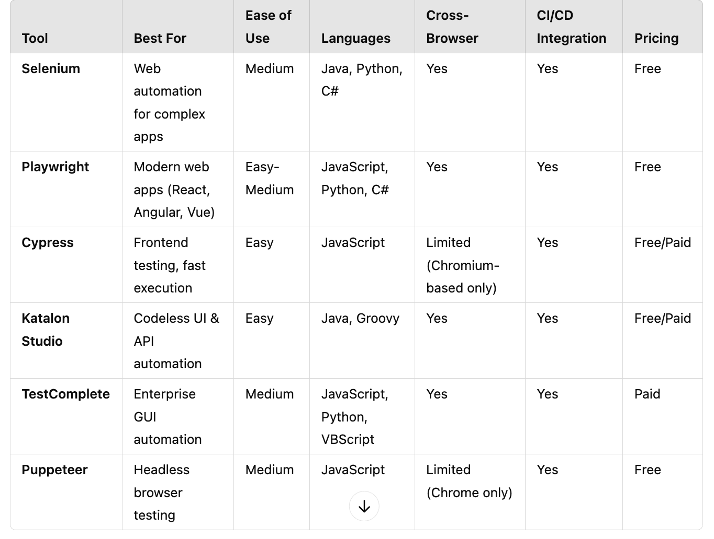

# About
There are many questions relates to topics: 
- "why we should use tool A, not tool B ?" 
- "Which tools I should learn to cover UI automation test for web app"

# Some factor to help us to choose the proper tools for covering UI automation testing

Here's a breakdown of keys that we can consider to choose the proper tools in automation test framework for UI web application testing:

## Property of your web application and your project
- Web application complexity level.
- Project size & no. members
- Team expert. Who is owner of your test framework? Who will contribute to test framework
- Test framework will support: CI/CD, Cross-Browser Testing, Docker, Cloud, Visual Testing, ...
- Budget: Use Free/ open-source tools or using paid tools

## Compare UI Automation Testing Tools
Here’s a comparison of the most popular tools based on key decision criteria: (Reference from ChatGPT)

## Which tool are suitable to be scaled 
ChatGPT did not mention the factor about the properties of your project or automation test requirement. In some cases,  complexity and easy-to-manage scale for any framework with the proper tool can be a big challenge.

# Which tools I should learn to gain a job ?
There are 2 main factors to help us answer the above question:
- Select the tool that current job market is wide, it helps you easy to find the job to join the real project and gain the actual experiences.
- Develop your wide know-how, which many skills with many tools, but you should keep your skill-set as T-shaped model

