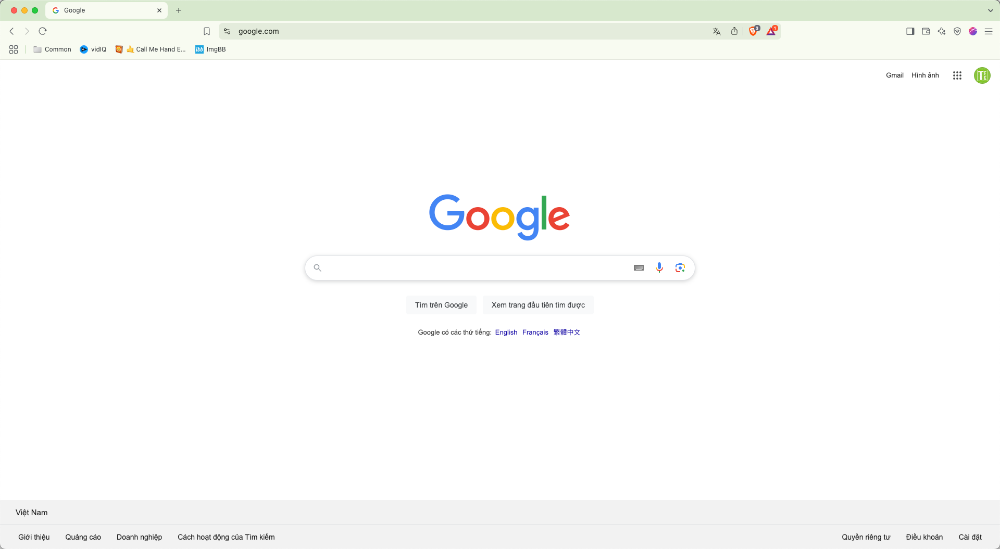

Idea: Use Gemini AI as an assistant to help us boost work productivity. In this post I would like to share you the way to use Gemini to help us improve UI and Visual Testing.

Boost your team's productivity and reduce the stress of UI and visual testing with the help of Gemini AI. This post will guide you through practical techniques and strategies for using Gemini to automate to generate the checklist for UI testing for a web application, improve accuracy, and ultimately, deliver higher-quality software faster.  Get ready to experience a significant leap forward in your development workflow.

# Create a simple UI checklist with Gemini 
Use Gemini to generate UI checklist to cover UI and Visual Testing
In the real project, we will have a design file example: Figma to define the designed element information, How your web application should be developed in UI view.
Due to no private disclosure, we don't have a specify UI design. I use Google search page as an example case as below image as based image.


I attached the Google search page screenshot to ask Gemini help me generate the checklist as bellow:

```textmate
I have a UI design for a web page as this image.
Could you provide the checklist to cover UI testing this page ?
```
And here is the result from Gemini: 


Here is the full response from Gemini as images that I captured


We can see Gemini AI helps us list out of almost essential point off Visual testing for a web app.
- UI Check Layout.
- Specify UI test
- Accessibility test
- Functionality works in browser.
- Performance UI and Security.

**Note: you still need to review and update the checklist how it is relevant to your project.**

# Use Gemini to execute visual testing
After I used Gemini AI to generate the UI check-list for covering testing for a web app, I will use Gemini to execute the UI testing to cover UI check Layout and some specify UI test. Let's see How Gemini play
I captured the screenshot of Google search page in my Brave browser to compare the visual UI of base image that I did in the previous step.

Here is my request to Gemini to ask it do comparison between base image and compared image.

- Based image
  
- Compared image



# The accuracy of AI response and Security aspect 
Keep in your mind: Gemini still can make mistake !!! we have to check again and Protect the data in your project.


# Happy Testing ^^

