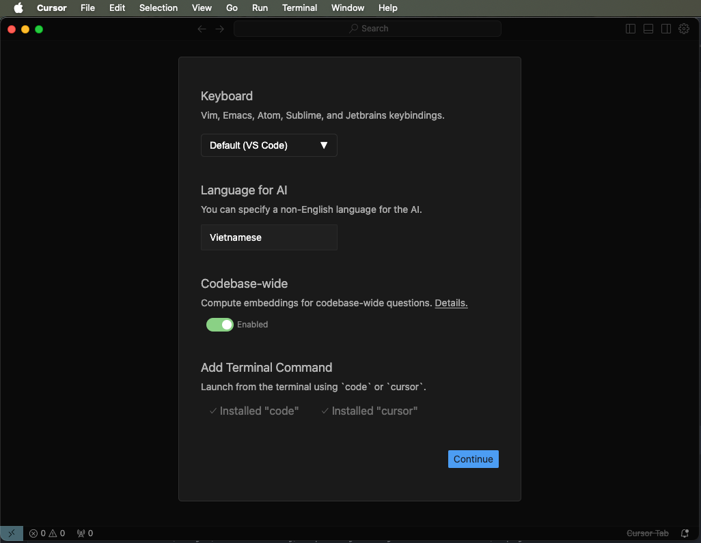
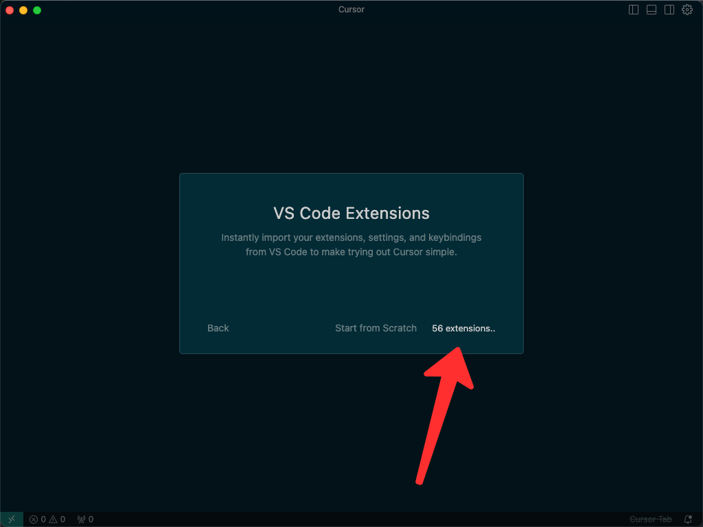
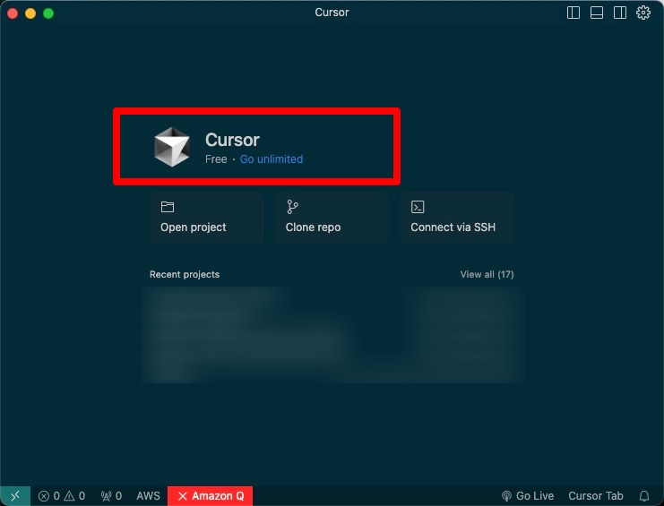

# Cursor - AI Editor Code
- Cursor lets you write code using instructions. Update entire classes or functions with a simple prompt.
- Source: [https://www.cursor.com/](https://www.cursor.com/)
- Example:

<iframe style="width:100%;" height="512" src="https://assets.basehub.com/191e7e6d/8ea9258a063943d01c1454f028b5294b/website-three-mp4.mp4?autoplay=1" allow=autoplay frameborder="0" allowfullscreen></iframe>

# Get Started 
- Download Cursor from: [https://www.cursor.com/](https://www.cursor.com/)
- And Open it, you can see this Cursor UI. Let's install the language model support. I tried to install Vietnamese more and choose Code and Cursor feature in Cursor as bellow:

- Start Cursor and importing VsCode Extension:

- Start Cursor AI Editor tool, after login via Google mail account.
