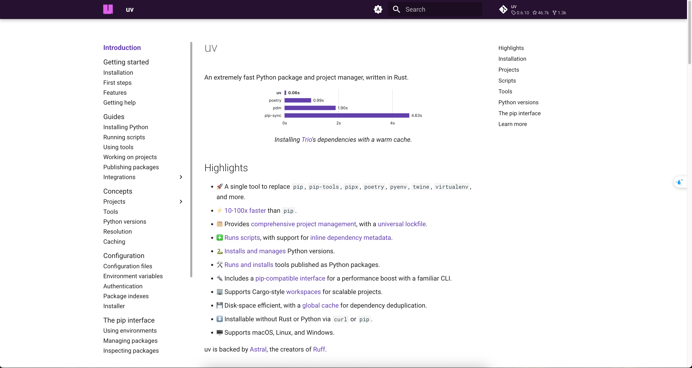
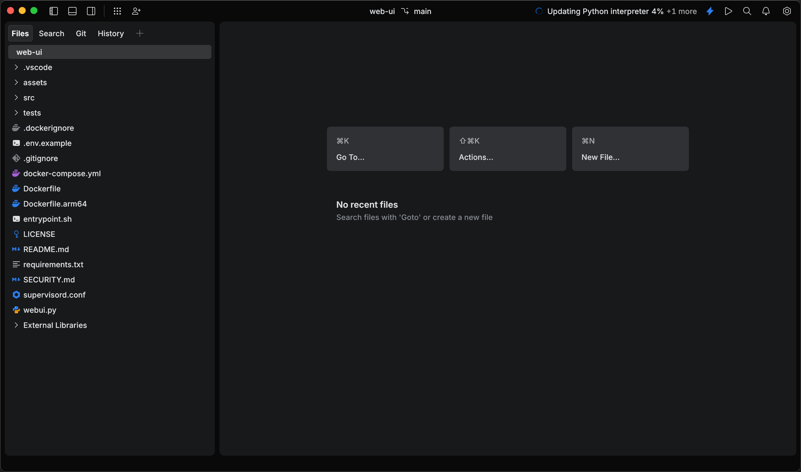
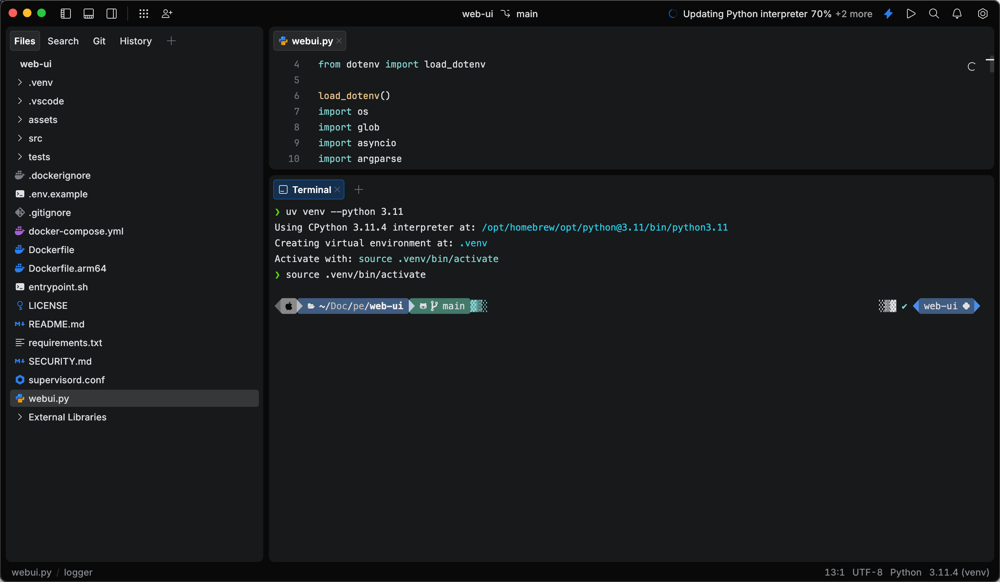
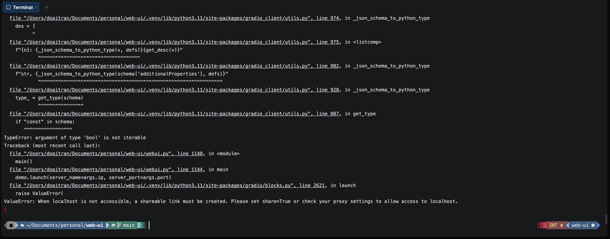

# About WebUI AI Agent

# Setup - Web UI agent Locally
Here is my note of all steps that we should do to run a Web Kit AI in our machine.
## Prerequisite
Install Python and uv python dependencies management

## Clone WebUI source

## Install Dependencies
Install Python packages:
`uv pip install -r requirements.txt`
Install Browsers in Playwright: You can install specific browsers by running:
`playwright install --with-deps chromium`
To install all browsers:
`playwright install`

## Issues when starting Web UI 

